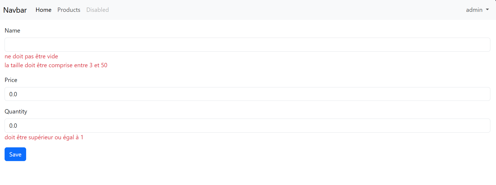

# Activite-Pratique_2---Spring-MVC---Spring-Data-JPA-Hibernate
# 🛒 Product Management Application - Spring Boot

## 📌 Description
Ce projet est une application Web JEE développée avec **Spring Boot** permettant de gérer des produits.  
L'application permet d'effectuer les opérations CRUD (Create, Read, Update, Delete) avec une interface web basée sur **Thymeleaf** et sécurisée avec **Spring Security**.

Ce projet a été réalisé dans le cadre d'une **activité pratique sur Spring MVC** afin de comprendre l'utilisation de :

- Spring Boot
- Spring MVC
- Spring Data JPA
- Hibernate
- Thymeleaf
- Spring Security
- Validation des formulaires

---

## 🧰 Technologies utilisées

- **Java**
- **Spring Boot**
- **Spring Web (Spring MVC)**
- **Spring Data JPA**
- **Hibernate**
- **Thymeleaf**
- **Spring Security**
- **H2 Database**
- **Bootstrap**
- **Lombok**

---

## 🏗 Architecture du projet

Le projet suit l'architecture classique **MVC (Model - View - Controller)** :
```text
activite-pratique-2-spring-mvc
│
├── src
│   ├── main
│   │   ├── java
│   │   │   └── ma.enset.activite_pratique_2_spring_mvc
│   │   │       ├── entities
│   │   │       │   └── Product.java
│   │   │       │
│   │   │       ├── repository
│   │   │       │   └── ProductRepository.java
│   │   │       │
│   │   │       ├── security
│   │   │       │   └── SecurityConfig.java
│   │   │       │
│   │   │       ├── web
│   │   │       │   └── ProductController.java
│   │   │       │
│   │   │       └── ActivitePratique2SpringMvcApplication.java
│   │   │
│   │   └── resources
│   │       ├── static
│   │       │
│   │       ├── templates
│   │       │   ├── layout1.html
│   │       │   ├── newProduct.html
│   │       │   ├── notAuthorized.html
│   │       │   └── products.html
│   │       │
│   │       └── application.properties
│   │
│   └── test
│
└── pom.xml
```

### Description des packages

- **entities** : contient les entités JPA (Product).
- **repository** : interfaces Spring Data JPA pour accéder à la base de données.
- **security** : configuration de Spring Security.
- **web** : contrôleurs Spring MVC.
- **templates** : vues Thymeleaf.
- **static** : fichiers statiques (CSS, JS, images).


---

## ⚙️ Fonctionnalités

L'application permet :

✔ Afficher la liste des produits  
✔ Ajouter un produit avec validation du formulaire (admin seul)  
✔ Supprimer un produit (admin seul)  
✔ Modifier / mettre à jour un produit (admin seul)  
✔ Sécuriser l'application avec **Spring Security**

---

## 🔐 Sécurité

L'application utilise **Spring Security** pour protéger l'accès aux fonctionnalités.

Fonctionnalités de sécurité :

- Authentification utilisateur
- Protection des routes
- Gestion des rôles (USER, ADMIN)

---

## 📸 Captures d'écran

### 📋 Liste des produits
*)*

---

### ➕ Ajouter un produit

**


---

### ✏️ Modifier un produit

**

---

## 📚 Ressource pédagogique

Cette application a été réalisée en suivant la vidéo :

https://www.youtube.com/watch?v=FHy7raIldgg


---

## 👨‍💻 Auteur

**Hugues Fawzi OUEDRAOGO**

Étudiant en Génie Logiciel  et des Systemes Informatique Distribues

Passionné par le développement backend avec **Java & Spring Boot**

---
